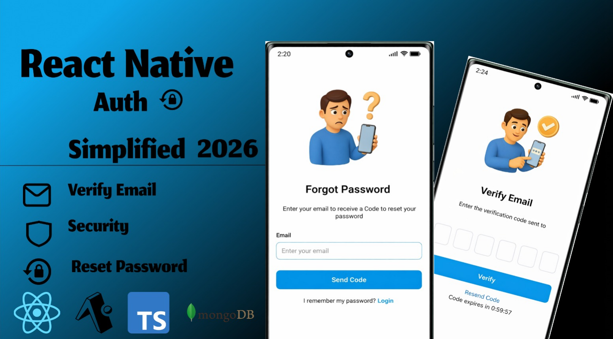
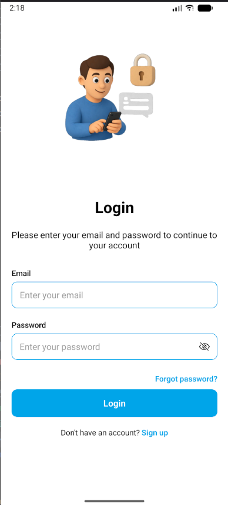
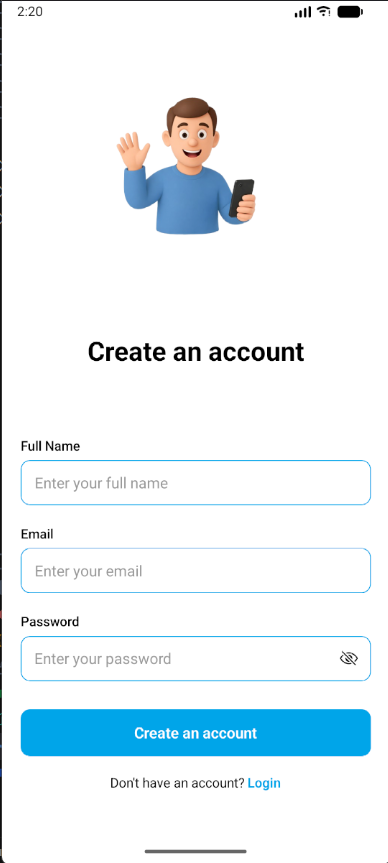
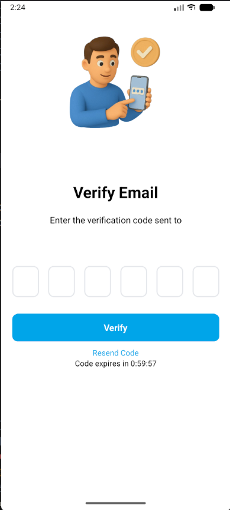
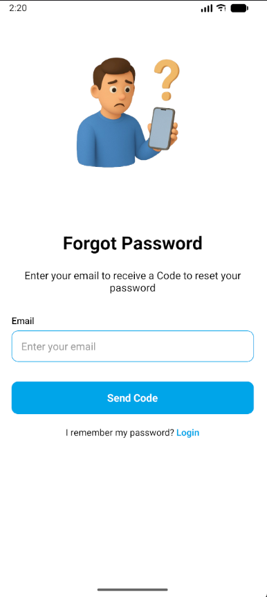
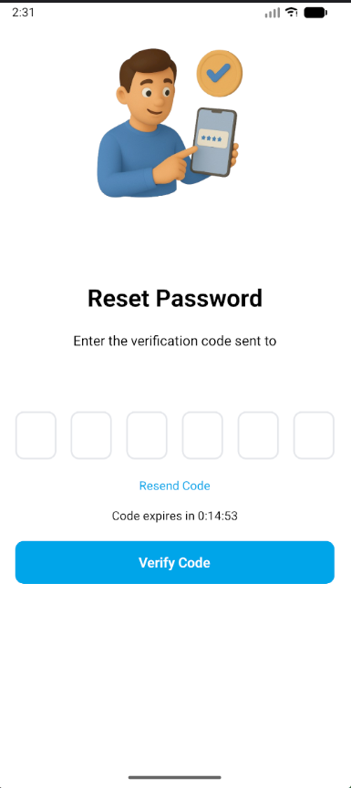
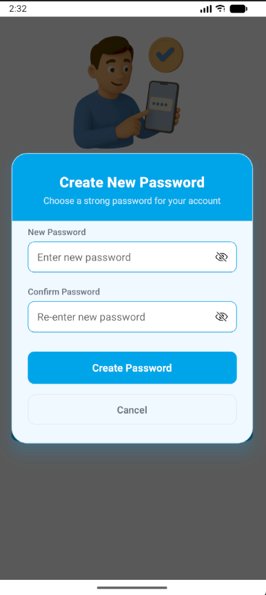
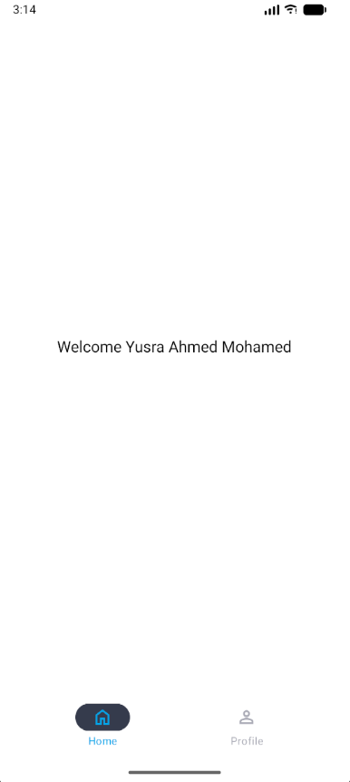
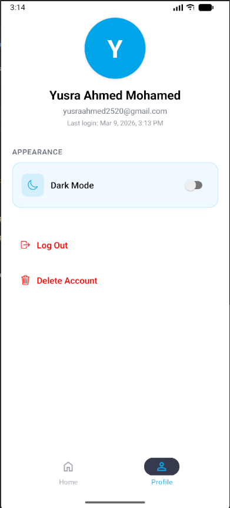
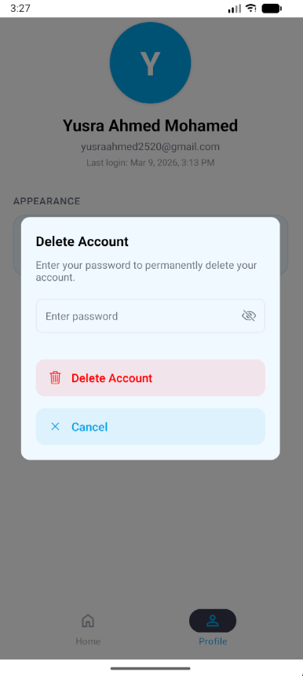

# Advanced Authentication UI (React Native/Expo) 👋

A premium, full-featured authentication system built with Expo 55, featuring a modern UI, secure backend integration, and robust state management.



## ✨ Highlights:

- 📱 Premium Authentication UI (React Native & Expo)
- ✨ Modern Glassmorphism & High-End UI/UX
- 🔐 Complete Auth Flow (Login, Register, Verify Email, Forgot Password, Reset Password, Logout)
- 📧 Secure Email Verification (Built-in OTP Service)
- 👤 Profile Management & Account Deletion
- 🌐 Integrated Backend (Expo Router + MongoDB)
- 🧠 Custom API Implementation (No 3rd Party Auth Services)
- 🚀 Backend with Bun, Mongoose, MongoDB & TypeScript
- 📡 Full REST API Design & Integration
- 🎨 Hardware-Accelerated Animations (Reanimated)
- 📱 Cross-Platform Support (iOS, Android & Web)
- 🛠️ Advanced State Management (Zustand & TanStack Query)
- 🧪 Type-Safe Form Validation (React Hook Form & Zod)
- 📧 Automated Email Delivery (Nodemailer & Templates)
- 🧰 Professional Project Structure & Clean Code
- 🌱 Scalable & Extensible Architecture
- 🤖 Optimized for Performance & Smooth Transitions
- 🔒 Secure Data Handling & JWT Integration
- 📚 Built with Modern React Native Patterns
- 🎯 Production-Level Authentication System

## 🚀 Tech Stack

- **Framework**: [Expo 55](https://expo.dev/) (SDK 55)
- **Navigation**: [Expo Router](https://docs.expo.dev/router/introduction/) (File-based routing)
- **Styling**: React Native StyleSheet + [Expo Glass Effect](https://github.com/expo/expo-glass-effect)
- **Animations**: [React Native Reanimated](https://docs.swmansion.com/react-native-reanimated/)
- **Data Fetching**: [@tanstack/react-query](https://tanstack.com/query/latest)
- **State Management**: [Zustand](https://github.com/pmndrs/zustand)
- **Backend/Database**: [Mongoose](https://mongoosejs.com/) (MongoDB)
- **Communication**: [Nodemailer](https://nodemailer.com/) (SMTP)
- **Validation**: [React Hook Form](https://react-hook-form.com/) & [Zod](https://zod.dev/)
- **Package Manager**: [Bun](https://bun.sh/) (Recommended)

## 🎨 Figma Design Link

- **Design Link**: [Design Link](https://www.figma.com/design/eRrz2XwVLw2sPkuTgLXfhZ/Auth-UI?node-id=0-1&t=3ogoCa3Nkhu0W26k-1)

- **Prototyping Link**: [Prototyping Link](https://www.figma.com/proto/eRrz2XwVLw2sPkuTgLXfhZ/Auth-UI?node-id=2-284&p=f&t=uRHo89FENRKFdDpE-1&scaling=min-zoom&content-scaling=fixed&page-id=0%3A1&starting-point-node-id=2%3A284)

## 📸 ScreenShots

- **Login Screen**: 
- **Register Screen**: 
- **Verify Email Screen**: 
- **Forgot Password Screen**: 
- **Reset Password Screen**: 
- **Reset Password Creation Screen**: 
- **Home Screen**: 
- **Profile Screen**: 
- **Delete Account Screen**: 

## 🛠️ Getting Started

### 1. Prerequisites

Ensure you have [Bun](https://bun.sh/) installed (or use npm/yarn).

### 2. Clone and Install

```bash
git clone <repository-url>
cd Auth-UI
bun install
```

### 3. Environment Variables

Create a `.env.local` file in the root directory (refer to `.env.example`):

```env
MONGO_URI=your_mongodb_connection_string
JWT_SECRET=your_jwt_secret
SMTP_USER=your_email
SMTP_PASS=your_email_password
SMTP_HOST=smtp.gmail.com
SMTP_PORT=587
```

### 4. Run the Project

```bash
bun start
```

- Press **'a'** for Android
- Press **'i'** for iOS
- Press **'w'** for Web
- Press **'r'** to reload
- Press **'d'** to open the debugger
- Press **'m'** to open the menu
- Press **'q'** to quit

## 📂 Project Structure

- `assets/`: Assets and images and styles.
- `src/app/`: Expo Router pages and API routes.
  - `app/api/`: API routes.
  - `app/(auth)/`: Authentication pages.
  - `app/(tabs)/`: Tab pages.
  - `app/_layout.tsx`: Root layout.
- `src/config/`: Configuration files.
- `src/components/`: Reusable UI components.
- `src/constants/`: Constants and enums.
- `src/emails/`: Email templates and handler.
- `src/hooks/`: Custom hooks.
- `src/lib/`: Libraries and utilities.
- `src/models/`: Mongoose database schemas.
- `src/services/`: API integration and business logic.
- `src/store/`: Zustand state management.
- `src/types/`: TypeScript types.
- `src/utils/` : utilities and helpers.
- `src/validations/`: Zod schemas for form validation.

## 📡 API Endpoints

- `POST /api/auth/register`: Create a new user.
- `POST /api/auth/verify-email`: Verify email with OTP.
- `POST /api/auth/login`: Authenticate user.
- `POST /api/auth/forgot-password`: Send reset code.
- `POST /api/auth/reset-password`: Update password.
- `POST /api/auth/resend-code`: Send Code to email by Verification and Forgot Password when code expire.
- `DELETE /api/auth/delete-account`: Remove user data.

---

Built with ❤️ by Khalid Hussein
